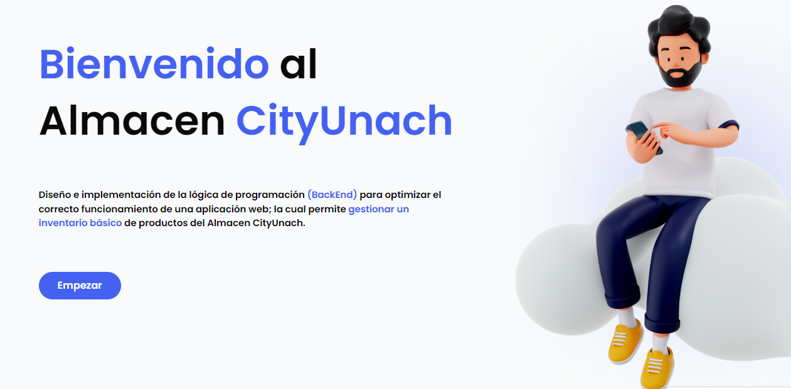

<h1>CityUnach Almacen 📋</h1>
Gestión de Almacén de Productos y Usuarios.
Evaluacion parcial 1- Examen practico para la materia Desarrollo web.
 
<h2>Descripción</h2>
Diseño e implementación de la lógica de programación (BackEnd) para optimizar el correcto funcionamiento de una aplicación web la cual permite gestionar un inventario básico de productos del Almacen y usuarios CityUnach. Elaborado con fines educativos.
 
<h2>Funcionalidades principales</h2>
<ul>
  <li> Registro y autenticación de usuarios. </li>
   <li>Gestión de productos en un almacén.</li>
   <li>Interfaz de usuario interactiva.</li>
</ul>

<h2>Interfaz</h2>

  

<h2>Tecnologias utilizadas</h2>
<ul>
  <li> HTML,CSS,JS </li>
   <li>PHP</li>
   <li>JQuery</li>
  <li>Ajax</li>
  <li>Bootstrap</li>
  <li>MySQL</li>
</ul>
<h2>Contacto</h2>

  

    
    <a href="https://www.linkedin.com/in/michelle-av" style="color:white">Irma Michelle Ayala Vazquez</a>  
    <a href="https://www.linkedin.com/in/lizeth-rodriguez45" style="color:white">Lizeth Guadalupe Rodriguez Rodriguez</a>
  

  
  
<h2>Créditos</h2>
<ul>
  <li>Dr. Christian Mauricio Castillo Estrada</li>
</ul>

<h2>URL</h2>
<a href="https://almacenmr.000webhostapp.com/index.php">Click me</a>
